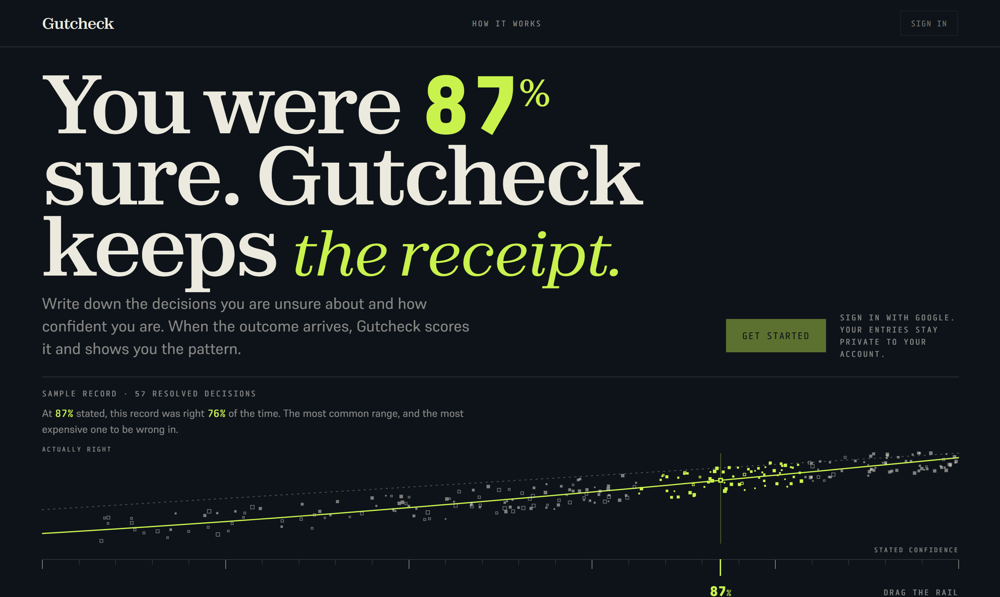
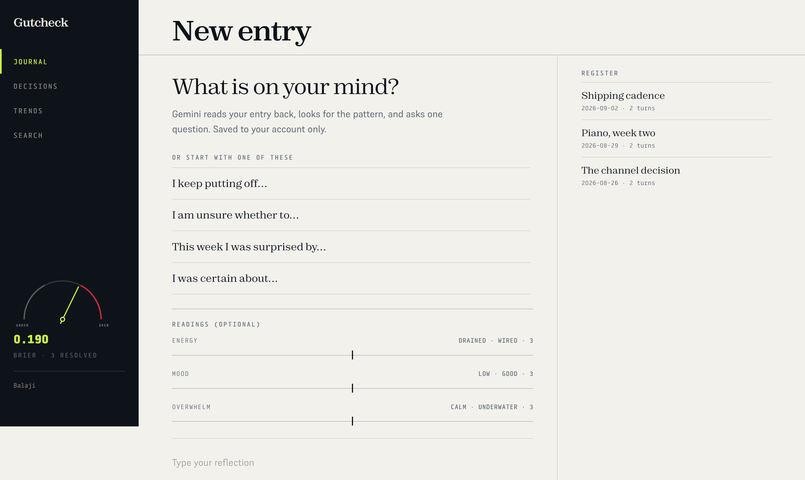
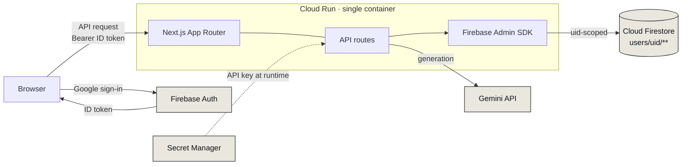
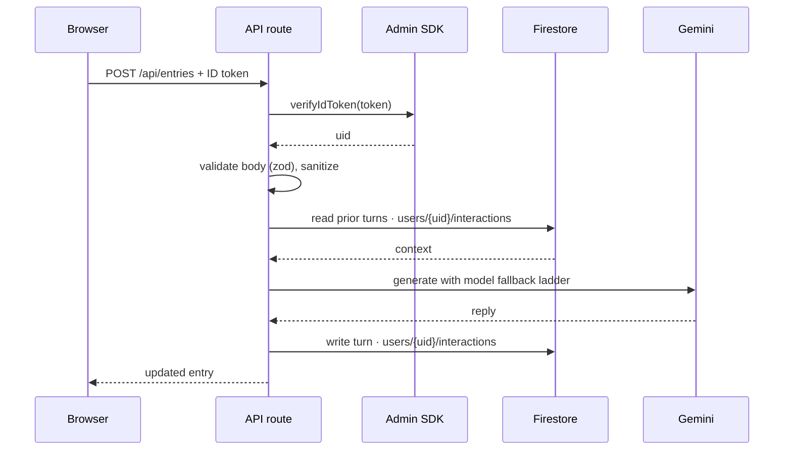

# Gutcheck

**A private decision journal that keeps score.**

Write down the decisions you are unsure about and how confident you feel. When
the outcome arrives, Gutcheck scores the call and shows you whether your
judgment is as good as you think it is.



---

## The problem

Knowing the outcome rewrites the memory. Once something has happened you
remember having expected it all along, so the feedback loop that would make you
a better decision-maker never closes. Most people are also measurably
overconfident: when they say they are 90% sure, they are right closer to 75% of
the time.

The fix is well established and almost nobody does it, because it requires
writing the prediction down *before* you know the answer.

Gutcheck makes that the path of least resistance:

1. Journal normally, in plain language.
2. When an entry is really a decision, attach a prediction and a confidence
   percentage.
3. On the review date the decision comes back and asks what actually happened.
4. Your calibration score updates whether you like it or not.

---

## Features

| | |
|---|---|
| **Conversational journal** | Multi-turn writing with Gemini. It reads the entry back, names the pattern it sees, and asks one question instead of agreeing with you. |
| **Decision tracking** | Log the reasoning, a prediction specific enough to be wrong, and a confidence percentage. Gemini stress-tests the reasoning at write time. |
| **Calibration score** | A Brier score for accuracy plus a signed bias showing whether you run over or under confident. |
| **Trend analysis** | Optional energy, mood and overwhelm readings per entry become a 45-day trace, with a flag when a sustained slide appears. |
| **Weekly recap** | A short written summary of the week drawn from your own entries. |
| **Semantic search** | Ask questions of your own archive in plain language. |



---

## How calibration works

Confidence is only meaningful if it tracks reality. A well-calibrated person who
says "80% sure" is right about 80% of the time, across many such calls.

Two numbers come out of the record:

**Brier score** measures accuracy. For each resolved decision it squares the gap
between stated confidence and what happened, then averages:

```
Brier = mean( (confidence − outcome)² )       outcome = 1 if right, 0 if wrong
```

Lower is better. `0.0` is perfect, `0.25` is what you get by always saying 50%,
and anything above that means the confidence figures are actively misleading.

**Signed bias** measures direction, and is the more useful of the two day to
day. Positive means overconfident, negative means underconfident:

```
Bias = mean( confidence − outcome )
```

The landing page plots this as a reliability diagram: stated confidence on the
horizontal axis, observed hit rate on the vertical, with the diagonal marking
perfect calibration. A curve sagging below the diagonal is the signature of
overconfidence, and it is what almost every real record looks like at first.

---

## Architecture

One container on Cloud Run serves both the interface and the API. The browser
never touches the database or the model directly.



Every API route repeats the same three steps before doing any work: verify the
ID token server-side, derive the user id from the verified token rather than
from the request body, and scope all database access to that user's subtree.

### Request lifecycle



If a Gemini model is unavailable, the call walks a fallback ladder rather than
failing, recovering from 429, 404, 500 and 503 responses:

```
gemini-3.6-flash → gemini-3.1-flash-lite → gemini-flash-latest → gemini-3.7-flash
```

### Data model

Everything a user owns lives under a single document keyed by their Firebase
uid, which makes isolation a structural property rather than a query filter that
somebody might forget.

```
users/{uid}
├── interactions/{id}    journal entries, each with its turns and mood readings
├── decisions/{id}       prediction, confidence, review date, outcome
└── digests/{id}         generated weekly recaps
```

### Security model

- **Google sign-in only.** No passwords are collected, stored or transmitted.
- **Server-side verification.** Every route verifies the Firebase ID token with
  the Admin SDK. The uid comes from the verified token, never from client input.
- **No direct client database access.** The browser has no read or write path to
  Firestore.
- **Owner-bound rules as defense in depth.** `firestore.rules` restricts every
  document to `request.auth.uid == userId`, with a deny-all fallback, so the
  data stays isolated even if the client SDK were ever used directly.
- **No hardcoded keys.** The Gemini key is held in Secret Manager and injected at
  runtime. It never reaches the browser.
- **Input validation.** Request bodies are parsed with zod schemas and sanitized
  before use.

See [`docs/THREAT_MODEL.md`](docs/THREAT_MODEL.md) for the full analysis.

---

## Tech stack

| Layer | Choice |
|---|---|
| Framework | Next.js 15 (App Router, `output: standalone`) |
| Language | TypeScript |
| Auth | Firebase Authentication |
| Database | Cloud Firestore |
| Model | Gemini via `@google/genai` |
| Styling | Tailwind CSS v4 + DaisyUI, custom theme |
| Motion | Motion, Lenis |
| Charts | Recharts, plus a hand-written canvas plot |
| Hosting | Cloud Run |

Typography is self-hosted: **Zodiak** for display, **Supreme** for body text and
**Tabular** for figures and interface labels.

---

## Getting started

**Requirements:** Node 22+, a Firebase project with Google sign-in enabled and
Firestore provisioned, a Gemini API key, and the `gcloud` CLI.

```bash
git clone https://github.com/BalajiReddy1/gutcheck.git
cd gutcheck
npm install
```

Copy the example environment file and fill it in:

```bash
cp .env.example .env.local
```

| Variable | Purpose |
|---|---|
| `NEXT_PUBLIC_FIREBASE_API_KEY` | Web app config. Public by design; Firestore rules are the real protection. |
| `NEXT_PUBLIC_FIREBASE_AUTH_DOMAIN` | Web app config. |
| `NEXT_PUBLIC_FIREBASE_PROJECT_ID` | Web app config. |
| `NEXT_PUBLIC_FIREBASE_APP_ID` | Web app config. |
| `FIREBASE_PROJECT_ID` | Server-side project id. |
| `FIREBASE_SERVICE_ACCOUNT_JSON` | Optional. Leave empty and use Application Default Credentials instead. |
| `GEMINI_API_KEY` | Server-side only. Never exposed to the browser. |

Authenticate the Admin SDK without putting key material on disk:

```bash
gcloud auth application-default login
```

Then run it:

```bash
npm run dev
```

`http://localhost:3000` serves the marketing page and `/dashboard` the
application. `/preview` renders the interface with sample data and no Firebase
connection, which is useful for design work.

```bash
npm run build       # production build
npm run typecheck   # tsc --noEmit
npm run lint        # next lint
```

---

## Deployment

Deploy the Firestore rules first:

```bash
firebase deploy --only firestore:rules
```

Store the model key as a secret:

```bash
gcloud secrets create gemini-api-key --replication-policy=automatic --data-file=-
```

Then deploy the container:

```bash
gcloud run deploy gutcheck \
  --source . \
  --region asia-south1 \
  --allow-unauthenticated \
  --set-secrets GEMINI_API_KEY=gemini-api-key:latest \
  --set-env-vars FIREBASE_PROJECT_ID=your-project-id
```

Grant the runtime service account `roles/datastore.user` and
`roles/secretmanager.secretAccessor`, then add the deployed URL to the Firebase
console under **Authentication → Settings → Authorized domains**, or sign-in
will fail in production.

> **Note on build-time configuration.** `NEXT_PUBLIC_*` values are inlined into
> the browser bundle by `next build`, which runs inside the Dockerfile. Passing
> them with `--set-env-vars` at deploy time is too late. They live in
> `.env.production`, which is committed deliberately and must contain nothing
> but the public Firebase web config.

---

## Project structure

```
src/
├── app/
│   ├── api/            route handlers, one per resource
│   ├── dashboard/      the signed-in application
│   ├── preview/        sample-data render, development only
│   ├── globals.css     design tokens, typography, component styles
│   ├── layout.tsx      metadata and structured data
│   └── page.tsx        landing page
├── components/
│   ├── land/           landing sections
│   ├── dev/            design tuning panel, stripped from production builds
│   └── *.tsx           journal, decisions, trends, search, gauge
└── lib/
    ├── db.ts           Firestore access, all uid-scoped
    ├── gemini.ts       model calls and fallback ladder
    ├── prompts.ts      system prompts
    ├── schemas.ts      zod request validation
    └── firebase.*.ts   client and admin initialization
```

---

## License

MIT. See [LICENSE](LICENSE).
